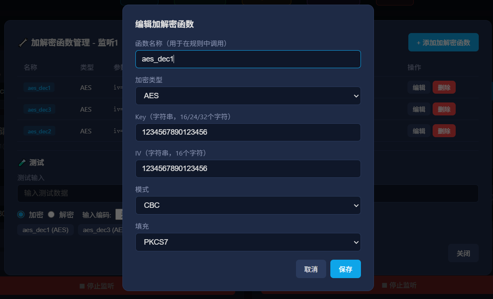
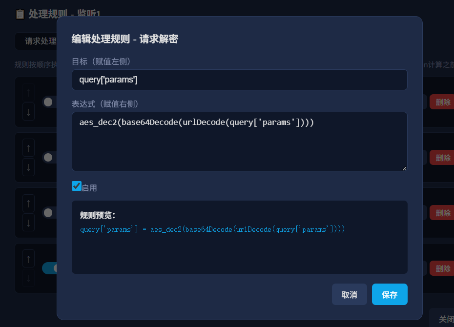
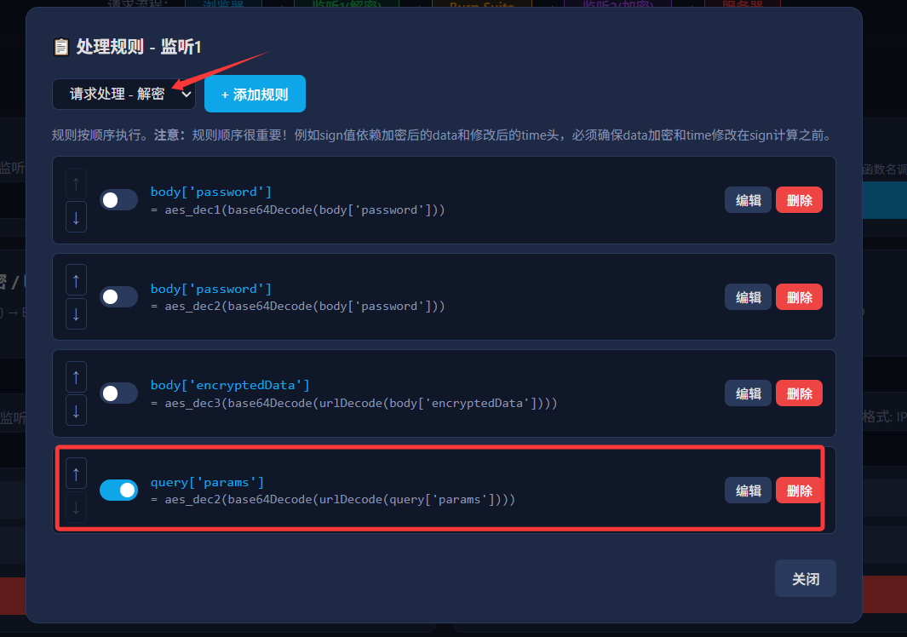
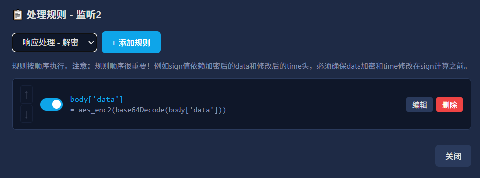
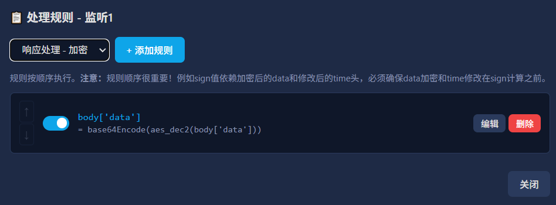
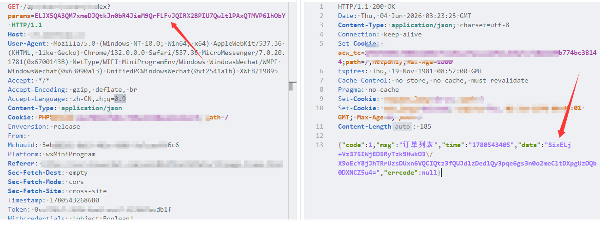
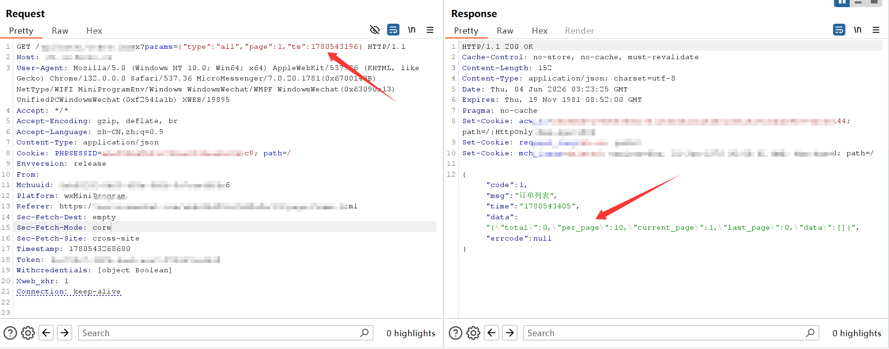
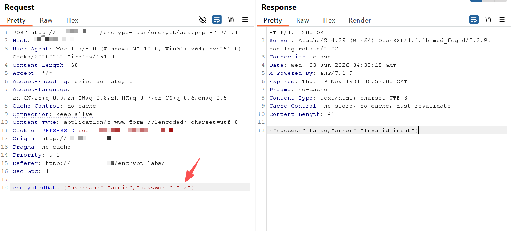
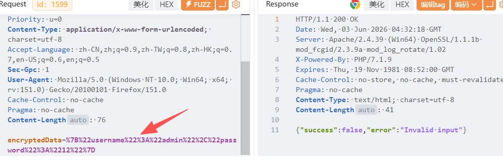
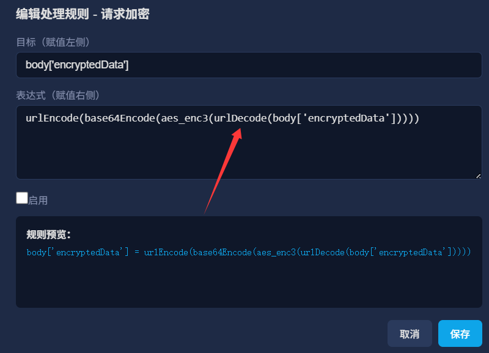

# WebCrypt - HTTP加解密代理工具

## 架构设计

### 数据流向

```
请求流程:
浏览器 → WebCrypt监听1(解密) → Burp Suite(修改和测试) → WebCrypt监听2(加密) → 服务器

响应流程:
服务器 → WebCrypt监听2(解密) → Burp Suite → WebCrypt监听1(加密) → 浏览器
```

### 双监听器设计

| 监听器 | 请求处理 | 响应处理 |
|--------|---------|---------|
| 监听1 | 解密请求（浏览器→Burp看到明文） | 加密响应（Burp修改后→浏览器看到密文） |
| 监听2 | 加密请求（Burp修改后→服务器收到密文） | 解密响应（服务器密文→Burp看到明文） |

这样设计确保 Burp Suite 不管是请求还是响应，看到的都是解密后的明文数据。

## 使用方法

### 1. 配置监听器

在界面上设置两个监听器：

- **监听1**：浏览器连接此监听，负责请求解密和响应加密
  - 监听地址：`127.0.0.1:7171`（浏览器代理设置为此地址）
  - 转发目标：`127.0.0.1:7272`（Burp的监听地址）

- **监听2**：Burp连接此监听，负责请求加密和响应解密
  - 监听地址：`127.0.0.1:7272`（Burp的上游代理设置为此地址）
  - 转发目标：留空（使用请求中的原始服务器地址）

- **白名单**：必填，填写需要加解密的域名或IP（如 `example.com`），只有匹配的流量才会被处理，监听1和监听2共用

### 2. 配置 Burp Suite

1. Burp Proxy 监听 `127.0.0.1:7272`
2. Burp 的上游代理设置为 `127.0.0.1:7272`（监听2的地址）
3. 浏览器代理设置为 `127.0.0.1:7171`（监听1的地址）

### 3. 添加加解密函数

在每个监听器的"加解密函数"中，根据目标网站的加密方式添加对应的加解密函数：

1. 点击"🔧 加解密函数"按钮
2. 点击"添加加解密函数"
3. 设置函数名称、类型和参数
4. 保存后即可在处理规则中使用

> **注意**：Key和IV输入类型为**字符串**（非Hex），请直接输入字符串值。系统会自动验证长度是否匹配算法要求。

### 4. 添加处理规则

在每个监听器的"处理规则"中，添加请求和响应的处理规则：

1. 点击"📋 处理规则"按钮
2. 选择方向（请求/响应）
3. 点击"添加规则"
4. 设置目标（如 `body['data']`）和表达式（如 `aes_dec1(body['data'])`）
5. **注意规则顺序！** 规则按从上到下的顺序执行

### 5. 加载Python插件（可选）

在白名单旁边的"📂 选择并加载Python插件"按钮，选择Python脚本文件即可加载自定义加解密函数。加载后可在处理规则中直接使用函数名调用。

### 6. 启动代理

点击监听器的"▶ 启动监听"按钮，代理开始工作。

### 7. 查看帮助

点击右上角的"📖 帮助"按钮，查看所有内置函数、加解密函数、Python插件函数的用法以及表达式语法说明。

## HTTPS 证书安装

首次启动代理时，WebCrypt 会自动在用户目录下生成 CA 证书：

- 证书目录：`~/.webcrypt/certs/`
- CA证书文件：`webcrypt_ca.crt`
- CA私钥文件：`webcrypt_ca.key`

在监听1标题旁点击"🔍 查看HTTPS证书"按钮可打开证书所在目录。

### 安装 CA 证书到浏览器

#### Windows (Chrome/Edge)

1. 双击 `webcrypt_ca.crt` 文件
2. 点击"安装证书"
3. 选择"本地计算机" → "将所有的证书放入下列存储"
4. 浏览选择"受信任的根证书颁发机构"
5. 完成安装
6. 重启浏览器

#### macOS

1. 双击 `webcrypt_ca.crt` 文件，将其添加到钥匙串
2. 打开"钥匙串访问"
3. 找到 "WebCrypt CA" 证书
4. 双击证书 → "信任" → "使用此证书时"选择"始终信任"
5. 重启浏览器

#### Firefox

1. 打开 Firefox 设置 → 隐私与安全 → 证书
2. 点击"查看证书" → "证书颁发机构"
3. 点击"导入"，选择 `webcrypt_ca.crt`
4. 勾选"信任由此证书颁发机构标识的网站"
5. 确定并重启浏览器

#### Linux

```bash
# Debian/Ubuntu
sudo cp webcrypt_ca.crt /usr/local/share/ca-certificates/
sudo update-ca-certificates

# RHEL/CentOS
sudo cp webcrypt_ca.crt /etc/pki/ca-trust/source/anchors/
sudo update-ca-trust
```

## 内置函数参考

### 编码函数

| 函数 | 说明 | 用法 |
|------|------|------|
| `base64Encode` | Base64编码 | `base64Encode(data)` |
| `base64Decode` | Base64解码 | `base64Decode(data)` |
| `urlEncode` | URL编码 | `urlEncode(data)` |
| `urlDecode` | URL解码 | `urlDecode(data)` |
| `unicodeEncode` | Unicode编码 | `unicodeEncode(data)` |
| `unicodeDecode` | Unicode解码 | `unicodeDecode(data)` |
| `hexEncode` | Hex编码 | `hexEncode(data)` |
| `hexDecode` | Hex解码 | `hexDecode(data)` |

### 字符串操作

| 函数 | 说明 | 用法 |
|------|------|------|
| `uppercase` | 转大写 | `uppercase(data)` |
| `lowercase` | 转小写 | `lowercase(data)` |
| `reverse` | 反转字符串 | `reverse(data)` |
| `replace` | 字符串替换 | `replace(data, old, new)` |
| `regReplace` | 正则替换 | `regReplace(data, pattern, replacement)`，`$1`/`$2`...引用分组 |
| `strip` | 去除首尾指定字符 | `strip(data, chars)` 或 `strip(data)`去除空白 |
| `stripQuotes` | 去除首尾引号 | `stripQuotes(data)` |
| `randomString` | 随机字符串(含大小写字母和数字) | `randomString(length)` |
| `randomLowerString` | 随机小写字符串 | `randomLowerString(length)` |
| `randomDigits` | 随机数字 | `randomDigits(length)` |

### JSON操作

| 函数 | 说明 | 用法 |
|------|------|------|
| `jsonSet` | 设置JSON字段值 | `jsonSet(jsonStr, key, value)`，数字自动识别为数字类型，支持`true`/`false`/`null` |
| `jsonGet` | 获取JSON字段值 | `jsonGet(jsonStr, key)` |

### 哈希函数

| 函数 | 说明 | 用法 |
|------|------|------|
| `md5` | MD5哈希(默认32位) | `md5(data)` 或 `md5(data, '16')` |
| `md5_16` | 16位MD5 | `md5_16(data)` |
| `md5_32` | 32位MD5 | `md5_32(data)` |
| `sm3` | SM3哈希 | `sm3(data)` |
| `sha1` | SHA-1哈希 | `sha1(data)` |
| `sha256` | SHA-256哈希 | `sha256(data)` |
| `sha512` | SHA-512哈希 | `sha512(data)` |
| `hmac` | HMAC(通用) | `hmac(algorithm, key, data)` |
| `hmacMD5` | HMAC-MD5 | `hmacMD5(key, data)` |
| `hmacSHA1` | HMAC-SHA1 | `hmacSHA1(key, data)` |
| `hmacSHA256` | HMAC-SHA256 | `hmacSHA256(key, data)` |
| `hmacSHA512` | HMAC-SHA512 | `hmacSHA512(key, data)` |

### 时间函数

| 函数 | 说明 | 用法 |
|------|------|------|
| `timestamp` | 时间戳(默认秒级) | `timestamp('秒')` 或 `timestamp('毫秒')` |
| `timestampSecond` | 秒级时间戳 | `timestampSecond()` |
| `timestampMillisecond` | 毫秒级时间戳 | `timestampMillisecond()` |
| `year` | 当前年份 | `year()` |
| `month` | 当前月份 | `month()` |
| `day` | 当前日期 | `day()` |
| `hour` | 当前小时 | `hour()` |
| `minute` | 当前分钟 | `minute()` |
| `second` | 当前秒数 | `second()` |
| `date` | 日期(yyyy/MM/dd) | `date()` |
| `dateY` | 日期(yyyy-MM-dd) | `dateY()` |
| `time` | 时间(HH:mm:ss) | `time()` |
| `dateTime` | 日期时间(yyyy/MM/dd HH:mm:ss) | `dateTime()` |
| `dateTimeY` | 日期时间(yyyy-MM-dd HH:mm:ss) | `dateTimeY()` |
| `dateTimeCompact` | 紧凑日期时间(yyyyMMddHHmmss) | `dateTimeCompact()` |
| `formatTime` | 自定义格式时间 | `formatTime('2006-01-02 15:04:05')` |
| `unixToDateTime` | 时间戳转日期时间 | `unixToDateTime(timestamp)` |
| `dateTimeToUnix` | 日期时间转时间戳 | `dateTimeToUnix('2024-01-01 00:00:00')` |

### 变量引用

| 变量 | 说明 | 示例 |
|------|------|------|
| `body` | 获取/设置整个请求体/响应体 | `body`（当加密数据就是整个body时使用） |
| `body['参数名']` | 获取/设置请求体中的参数 | `body['data']`, `body['user.name']` |
| `headers['头名称']` | 获取/设置请求头 | `headers['time']`, `headers['sign']` |
| `query['参数名']` | 获取/设置URL查询参数 | `query['token']`, `query['sign']` |

> **注意**：
> - 当加密数据直接是整个请求体（没有参数名）时，使用 `body` 获取。例如请求体为 `eyJ1c2VyaWQiOjF9`（纯Base64字符串），规则为 `body = base64Decode(body)`。
> - `query['参数名']` 仅在请求处理中可用，用于处理URL中的查询参数（如 `?token=xxx&sign=yyy`）。

### 字符串拼接

使用 `+` 连接多个值：

```
headers['time']+body['data']     # 拼接时间头和data参数
'prefix_'+body['data']           # 添加前缀
body['data']+'_suffix'           # 添加后缀
```

## 加解密函数配置

> **重要**：
> - Key和IV的输入类型为**字符串**（非Hex编码），请直接输入字符串值。系统会在保存时自动验证长度。
> - 加解密函数的输出为**原始二进制数据**（非自动编码），如需编码请在处理规则中显式使用编码函数（如 `hexEncode`、`base64Encode`）。例如：`body['data'] = hexEncode(aes_enc1(body['data']))`。

### 编码处理原则

WebCrypt 的加解密函数输出原始二进制数据，不自动添加任何编码。用户需要在处理规则中显式控制编码/解码流程：

```
# 解密流程：先解码输入，再解密
body['data'] = aes_dec1(hexDecode(body['data']))

# 加密流程：先加密，再编码输出
body['data'] = hexEncode(aes_enc1(body['data']))
```

常见的编码组合：
- Hex编码的密文：使用 `hexDecode` 解码输入，`hexEncode` 编码输出
- Base64编码的密文：使用 `base64Decode` 解码输入，`base64Encode` 编码输出
- URL编码的密文：使用 `urlDecode` 解码输入，`urlEncode` 编码输出

### AES

| 参数 | 说明 | 可选值 |
|------|------|--------|
| key | 密钥（字符串） | 16/24/32个字符 |
| iv | 初始向量（字符串） | 16个字符(ECB模式不需要) |
| mode | 加密模式 | CBC, ECB, CFB, OFB, CTR, GCM |
| padding | 填充方式 | PKCS5, PKCS7, Zero, None |

### DES

| 参数 | 说明 |
|------|------|
| key | 8个字符密钥（字符串） |
| iv | 8个字符初始向量（字符串） |

### 3DES (DESede)

| 参数 | 说明 |
|------|------|
| key | 16或24个字符密钥（字符串，16字符自动扩展为24字符） |
| iv | 8个字符初始向量（字符串） |

### RSA

| 参数 | 说明 |
|------|------|
| publicKey | PEM格式公钥 |
| privateKey | PEM格式私钥 |

### SM4（国密对称加密）

| 参数 | 说明 | 可选值 |
|------|------|--------|
| key | 16个字符密钥（字符串） | 任意16个字符 |
| iv | 16个字符初始向量（字符串） | 任意16个字符(ECB/CTR模式不需要) |
| mode | 加密模式 | CBC, ECB, CFB, OFB, CTR |

### SM2（国密非对称加密）

| 参数 | 说明 |
|------|------|
| publicKey | Hex格式公钥（04+X+Y未压缩格式） |
| privateKey | Hex格式私钥 |
| outputMode | 输出格式：hex 或 base64 |

## 使用示例

### 示例1：Base64编码数据

浏览器发送的数据被Base64编码：

```
POST /getUser HTTP/1.1
User-Agent: xxxx

data=eyJ1c2VyaWQiOjF9
```

**监听1 - 请求处理（解密）：**
```
body['data'] = base64Decode(body['data'])
# 解密后: data={"userid":1}
```

**监听2 - 请求处理（加密）：**
```
body['data'] = base64Encode(body['data'])
# 加密后: data=eyJ1c2VyaWQiOjF9
```

响应过程相反，添加对应的响应处理规则，然而实际中可能要再增加一个url编码和解密。

### 示例2：AES CBC加密 + 时间戳 + MD5签名

浏览器发送的数据被AES CBC加密（Hex编码），key为`1234567890123456`，iv为`1234567890123456`，同时请求带有时间戳和签名：

```
POST /getUser HTTP/1.1
User-Agent: xxxx
time: 1780298489
sign: b1b61be166d879741d65be01bfdba647

data=c5d449bd9146ca7227146f81cd2265af
```

**步骤1：创建加解密函数**

- `aes_dec1`: AES解密, key=`1234567890123456`, iv=`1234567890123456`, mode=CBC, padding=PKCS7

- `aes_enc1`: AES加密, key=`1234567890123456`, iv=`1234567890123456`, mode=CBC, padding=PKCS7



**步骤2：监听1 - 请求处理（解密，密文为Hex编码）**

```
规则1: body['data'] = aes_dec1(hexDecode(body['data']))
```

**步骤3：监听2 - 请求处理（加密，注意顺序！）**

```
规则1: body['data'] = hexEncode(aes_enc1(body['data']))             # 先加密data，再Hex编码
规则2: headers['time'] = timestamp('秒')                              # 再设置时间戳
规则3: headers['sign'] = md5(headers['time']+body['data'],32)        # 最后计算签名
```

**注意**：规则顺序不能乱！sign值是使用请求头中的时间戳和请求体中加密后的data值计算MD5得来。如果乱了，data还没加密或者time头还没修改，就会导致sign值计算错误。

**步骤4：监听2 - 响应处理（解密）**
```
规则1: body['data'] = aes_dec1(hexDecode(body['data']))
```

**步骤5：监听1 - 响应处理（加密）**
```
规则1: body['data'] = hexEncode(aes_enc1(body['data']))
```

### 示例3：AES加密 + 修改JSON字段（jsonSet / regReplace）

浏览器发送的请求参数被AES加密（Base64编码 + URL编码），解密后是JSON格式，需要修改其中的时间戳字段：

```
请求: params=ELJX5QA3QM7xmeDJQtkJn0bR4JieM9QrFLFvJQIR%2BPIU7QwltlPAxQTMVP6lhObY
```

URL解码 + Base64解码 + AES解密后：
```json
{"goods_id":15157,"per_page":4,"type":"all","ts":1780500701}
```

**步骤1：创建加解密函数**

- `aes_dec2`: AES解密, key/iv按实际配置
- `aes_enc2`: AES加密, key/iv按实际配置

**步骤2：监听1 - 请求处理（解密）**
```
规则1: query['params'] = aes_dec2(base64Decode(urlDecode(query['params'])))
```





**步骤3：监听2 - 请求处理（加密 + 更新时间戳）**

注意这里是有一个时间戳在解密结果中，需要在发送前更新时间戳后发送。

方式一：使用 `jsonSet`（推荐，精准修改JSON字段）：
```
规则1: query['params'] = urlEncode(base64Encode(aes_enc2(jsonSet(urlDecode(query['params']), 'ts', timestampSecond()))))
```

方式二：使用 `regReplace`（正则替换，适用于非JSON格式）：
```
规则1: query['params'] = urlEncode(base64Encode(aes_enc2(regReplace(urlDecode(query['params']), '"ts":\\d+', '"ts":' + timestampSecond()))))
```

**说明**：

- `jsonSet` 直接操作JSON对象，指定key和value即可，数字类型自动识别
- `regReplace` 使用正则匹配 `"ts":数字` 并替换，`$1`/`$2`可引用捕获组
- 两种方式效果相同，`jsonSet` 更安全可靠，`regReplace` 更灵活（适用于非JSON字符串）

**步骤4：监听2 - 响应处理（解密）**

```
body['data'] = aes_dec2(base64Decode(body['data']))
```



**步骤5：监听1 - 响应处理（加密）**

```
body['data'] = base64Encode(aes_enc2(body['data']))
```



说明：截图中混用aes_dec2和aes_enc2是因为aes加解密配置都是一样的，只是用的地方不一样。

实现效果





### 示例4：带引号的请求和响应

当请求体和响应体是带引号的加密字符串时，body代表整个请求体，需要去除双引号：

```
POST /getUser HTTP/1.1
User-Agent: xxxx

"eyJ1c2VyaWQiOjF9"
```

**监听1 - 请求处理（解密）：**

```
规则1: body = base64Decode(stripQuotes(body))
# 或使用replace: body = base64Decode(replace(body, '"', ''))
```

**监听2 - 请求处理（加密）：**

```
规则1: body = '"' + base64Encode(body) + '"'
```

### 示例5：使用Python插件

对于使用自定义加解密算法的网站，可以编写Python插件：

```python
# custom_crypto.py
def custom_encrypt(data):
    """自定义加密函数"""
    import base64
    return base64.b64encode(data.encode()).decode()

def custom_decrypt(data):
    """自定义解密函数"""
    import base64
    return base64.b64decode(data.encode()).decode()
```

点击"📂 选择并加载Python插件"按钮选择脚本文件，加载后函数会自动注册，**直接在处理规则中使用函数名调用**：
```
body['data'] = custom_encrypt(body['data'])
body['data'] = custom_decrypt(body['data'])
```

## Python插件格式

### 基本格式

```python
"""
WebCrypt Python插件
函数必须接收字符串参数，返回字符串结果。
加载后可直接在处理规则中使用函数名调用。
"""

def function_name(data):
    """函数说明

    Args:
        data: 输入字符串

    Returns:
        处理后的字符串
    """
    # 实现逻辑
    return result
```

### 规则

1. 函数必须接收字符串参数，返回字符串结果
2. 加密函数和解密函数需要分别定义（如 `custom_encrypt` 和 `custom_decrypt`）
3. 可以使用Python标准库中的任何模块
4. 第三方库需要预先安装（如 `pycryptodome`），加载插件时会自动检查依赖是否已安装，缺少依赖会提示安装命令
5. 加载插件后，函数会自动注册到系统中
6. **直接在处理规则中使用函数名调用**，无需在加解密函数中配置
7. 支持定义多个函数，每个函数都会被注册
8. 支持类方法（如 `MyCrypto.encrypt`），但不推荐

### 使用流程

1. 编写Python脚本，定义需要的函数
2. 在WebCrypt界面白名单旁边，点击"📂 选择并加载Python插件"按钮选择脚本文件
3. 加载成功后，插件详情区域会显示已注册的函数名
4. 在处理规则中直接使用函数名，如 `body['data'] = custom_decrypt(body['data'])`

### 示例插件

参见 `plugins/` 目录下的示例：
- `example.py` - 基本模板，包含多种常用函数

## 请求体解析

WebCrypt 支持精准识别和解析多种请求体格式：

| 格式 | Content-Type | 示例 |
|------|-------------|------|
| JSON | application/json | `{"data": "value"}` |
| Form | application/x-www-form-urlencoded | `data=value&name=test` |
| XML | application/xml, text/xml | `<root><data>value</data></root>` |

### 参数访问

- **JSON**: `body['data']` 或嵌套访问 `body['user.name']`
- **Form**: `body['data']`
- **XML**: `body['data']` 或嵌套访问 `body['root.data']`

## 注意项

### 注意项一：

测试发现，解密后修改重放后，实际发出去**burp会自动做url编码**再发出去的。



使用yakit接受，接收到的数据就是经过burp url编码后的数据。



如果数据只经过burp，**没有**在burp中拦截修改或者放到重放模块发送，那么burp**不会**url编码，会原始转发出去。

burp的自动url编码的逻辑是（问的deepseek）：

在请求体（Body）中：编码与否，完全由 Content-Type 请求头说了算。如果请求头是 application/x-www-form-urlencoded（表单格式），它会对参数值中的特殊字符（如 &、=、空格）进行编码，以保证结构的完整性。但如果请求头是 application/json、text/xml 这类数据格式，它就不会自动编码，以免破坏数据的原始结构。

而相比burp，yakit的fuzz，发出去的数据包就是原始数据包，不会自动做url编码处理。

因此如果监听2接受burp的修改数据再加密，就需要经过url解码，再加密，否则加密的数据是url编码后的数据就可能会导致结果出错。



### 注意项二：

目前没有做那种动态密钥（每次请求密钥都在变）的那种加解密的处理，要处理，可以自己写写python插件试试。

## 参考项目

参考项目：https://github.com/cloud-jie/CloudX
